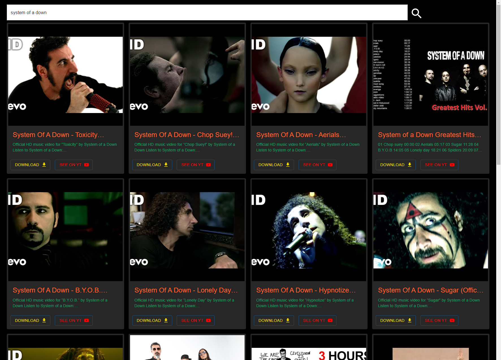

## React + Node app for searching and downloading music from youtube

### Installation and execution
Make sure that you have `ffmpeg` installed
Create `.env` file inside `backend` folder and add:

```
YOUTUBE_KEY=<your youtube API key>
PORT=8080
```

* Go to `backend` and run `npm install`
* Go to `frontend` and run `npm install`
* Run `npm run dev` from `frontend` folder
* In another terminal run `npm start` from `backend` folder
* Go to `http://127.0.0.1:5173/` in your browser - the app should be working and able to search/ download music from YouTube (files will be downloaded to `backend/media` folder)

### Screenshot of running app

